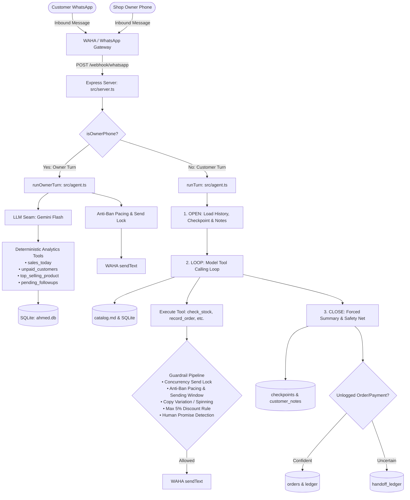

# Ahmed's WhatsApp Assistant

[](https://www.typescriptlang.org/)
[](https://nodejs.org/)
[](https://github.com/WiseLibs/better-sqlite3)
[](https://ai.google.dev/)
[-25D366.svg?style=flat-square&logo=whatsapp)](https://waha.devlike.pro/)
[](#architecture--data-flow)

> **A production-ready, autonomous WhatsApp AI sales agent and business operational intelligence partner designed for a single-owner retail clothing enterprise.**

Unlike generic toy chatbots, this system is an end-to-end, single-tenant commercial engine: it communicates in natural bilingual mix (English and Roman Urdu), manages conversational context across multi-day threads, executes audit-grade double-entry bookkeeping, maintains real-time inventory synchronization with an order Finite State Machine (FSM), enforces rigorous anti-ban safety guardrails, and provides real-time private business analytics to the shop owner via WhatsApp.

---

## 🌟 Key Highlights

* **Autonomous Bilingual Sales Agent**: Handles 24/7 customer inquiries, product discovery, and order negotiations in fluent English and colloquial Roman Urdu with zero hallucinated inventory or pricing.
* **Persistent Conversational Memory**: Employs rolling context checkpoints + long-term structured facts (`customer_notes`) so returning customers are recognized without repeating preferences.
* **Double-Entry Financial Ledger**: What customers owe is dynamically derived by summing debit and credit events in `ledger`—completely eliminating balance calculation drift.
* **FSM Order Lifecycle & Live Stock Sync**: Forward-only state machine (`placed → confirmed → paid → shipped → delivered`) that automatically decrements stock on confirmation and restores stock and ledger credits upon cancellation.
* **Turn-Close Safety Net**: Automatically catches orders or payments agreed upon in natural language that were not explicitly logged by the model during the turn loop.
* **Owner Executive Analytics (Private WhatsApp Mode)**: Caller-ID fail-closed authentication routes messages from the owner's personal phone to a private executive assistant equipped with deterministic BI report tools (`sales_today`, `unpaid_customers`, `top_selling_product`, `pending_followups`) with zero SQL injection risk.
* **Production Anti-Ban & Guardrail Suite**: In-process promise-chain mutex (`withSendLock`) guarantees anti-ban pacing (daily volume caps, warmup curves, jitter throttling), spinning copy-variation detection, 5% unauthorized discount limits, and human-promise verification.

---

## 🏗️ Architecture & Data Flow



---

## 🚀 Implemented Capabilities & Roadmap

The application delivers against all four commercial business promises:

### 1. Autonomous Sales & Grounded Conversation
- **Instant, Grounded Replies**: Product queries, return/exchange policies, delivery timelines, and accepted payment methods (COD, Bank Transfer, Easypaisa, JazzCash) are grounded in [catalog.md](catalog.md) with 3x title-weighted keyword matching.
- **Strict Guardrails**: Disallows unauthorized discounts $\ge 5\%$ without owner confirmation, prevents empty promises (*"Ahmed will call you"* is blocked unless `notify_owner` was executed), and delivers a one-time virtual assistant disclosure on first contact.

### 2. Conversational Memory & Context Preservation
- **Checkpoints**: After every turn, a forced second LLM call summarizes the current conversation state (what was discussed, what is owed, commitments made).
- **Durable Customer Notes**: Permanent customer preferences (e.g. *"prefers black"*, *"orders in bulk"*) are extracted into `customer_notes` and automatically injected into subsequent conversations across days or weeks.

### 3. Automated Bookkeeping, FSM Orders & Live Inventory
- **Dynamic Ledger**: Balance owed is computed via $\sum(\text{debits}) - \sum(\text{credits})$. Zero mutable `balance_owed` fields.
- **Forward-Only Finite State Machine (FSM)**:
  $$\text{placed} \longrightarrow \text{confirmed} \longrightarrow \text{paid} \longrightarrow \text{shipped} \longrightarrow \text{delivered}$$
  $$\text{placed / confirmed / paid} \longrightarrow \text{cancelled}$$
- **Synchronized Inventory**: Orders in `placed` reserve nothing; transitioning to `confirmed` decrements `products.stock`. Pre-shipping cancellations automatically restore stock and issue a ledger credit reversal.
- **Turn-Close Extraction Safety Net**: A defensive extraction prompt at turn-close detects orders or payments mentioned in natural conversation that the AI failed to log via tools, either auto-recording them if confident or alerting the owner.

### 4. Owner Operational Intelligence (WhatsApp BI)
- **Zero-Interface Reporting**: Ahmed texts the shop number directly from his personal phone; the system recognizes his number and routes to a dedicated analytics assistant.
- **Deterministic SQL-Backed Reports**:
  - `sales_today`: Real-time shop revenue for the current business day.
  - `unpaid_customers`: Ranked list of customers with outstanding balances.
  - `top_selling_product`: All-time volume and revenue leader across completed orders.
  - `pending_followups`: Overdue unpaid orders sitting for $>2$ days (flagged overdue if $>7$ days).

---

## 🛠️ Technology Stack

| Layer | Technology | Purpose |
|---|---|---|
| **Runtime & Language** | Node.js (v20+ / v22), TypeScript (Strict Mode) | Strong type safety and modern asynchronous execution. |
| **Server Framework** | Express.js | High-throughput, lightweight webhook listener. |
| **Database** | SQLite via `better-sqlite3` | In-process, ultra-low latency relational database with atomic transactions. |
| **AI / LLM Engine** | Google Gemini (`gemini-flash-lite-latest`) | High-speed function calling with thought-signature preservation. |
| **WhatsApp Gateway** | WAHA (WhatsApp HTTP API - Devlike) | Decoupled WhatsApp Web session management and message dispatch. |
| **Concurrency Control** | In-Process Promise-Chain Mutex (`withSendLock`) | Guarantees FIFO message serialization across asynchronous turns. |

---

## 📂 Project Structure

```
├── catalog.md                  # Human-maintainable product catalog & store FAQ
├── db/
│   └── schema.sql              # Relational SQLite schema (9 tables, audit ledger, checkpoints)
├── scripts/
│   ├── seed-catalog.ts         # Idempotent database seeder based on catalog.md
│   └── test-v2-flow.ts         # Comprehensive deterministic test suite for orders & ledger
├── src/
│   ├── agent.ts                # Turn loop engine: OPEN -> LOOP -> CLOSE, send guardrails
│   ├── analytics.ts            # Deterministic business intelligence report functions
│   ├── catalog.ts              # Weighted keyword search engine for catalog.md
│   ├── db.ts                   # SQLite singleton, startup migrations & schema integrity
│   ├── followups.ts            # Derived follow-up tracking for unpaid orders
│   ├── ledger.ts               # Double-entry debit/credit ledger and balance resolution
│   ├── llm.ts                  # Single-seam LLM gateway for Google Gemini
│   ├── orders.ts               # Order state machine (FSM), stock decrement & restore logic
│   ├── owner.ts                # Fail-closed caller authentication for the shop owner
│   ├── server.ts               # Express entry point for WhatsApp webhooks & turn dispatch
│   ├── tools.ts                # Business actions & analytics tool definitions
│   ├── types.ts                # Core domain TypeScript interfaces
│   ├── channel/
│   │   ├── types.ts            # Provider-agnostic ChannelAdapter interface
│   │   └── waha.ts             # WAHA REST adapter with LID privacy-JID resolution
│   ├── guardrails/
│   │   ├── discount-rules.ts   # Regex-based 5% discount limit & retrospective checks
│   │   ├── human-promise.ts    # Handoff promise detector
│   │   ├── messaging-window.ts # Operational hours enforcement (07:00 - 22:00 PKT)
│   │   ├── pacing/             # Anti-ban throttle engine (daily caps, warmup curves, jitter)
│   │   └── spinning/           # Outbound text variation & anti-spam detection
│   └── obs/
│       └── logger.ts           # Structured JSON logger
└── tsconfig.json               # Strict TypeScript configuration
```

---

## ⚙️ Getting Started

### Prerequisites
* **Node.js**: v20 or higher
* **Docker**: Required for running WAHA locally
* **Google Gemini API Key**: [Google AI Studio](https://aistudio.google.com/)

### 1. Installation
Clone the repository and install dependencies:
```bash
git clone https://github.com/<your-username>/ahmed-whatsapp-assistant.git
cd ahmed-whatsapp-assistant
npm install
```

### 2. Environment Configuration
Create an environment configuration (or set environment variables in your terminal):
```bash
export GEMINI_API_KEY="your-google-gemini-api-key"
export WAHA_BASE_URL="http://localhost:3001"
export WAHA_SESSION="default"
export AHMED_OWNER_PHONE="923001234567"      # Owner's personal WhatsApp number
export PORT=3000
```

### 3. Start WAHA (WhatsApp Gateway)
Run the headless WhatsApp bridge using Docker:
```bash
docker run -it --name waha -p 3001:3001 -e "WHATSAPP_HOOK_URL=http://localhost:3000/webhook/whatsapp" -e "WHATSAPP_HOOK_EVENTS=message" devlikeapro/waha
```
* Open `http://localhost:3001` in your browser and link your WhatsApp account using QR code or pairing code.

### 4. Seed the Product Inventory
Populate the database with initial products from `catalog.md`:
```bash
npx tsx scripts/seed-catalog.ts
```

### 5. Start the Application
Run the assistant server:
```bash
npm run dev
# Or using the auto-restart loop:
bash _tmp-run-loop.sh
```

The service will start on port `3000`, listening for inbound WhatsApp webhooks at `/webhook/whatsapp`.

---

## 🧪 Testing & Verification

The repository includes deterministic, isolated test suites that verify the entire operational cycle without requiring live WhatsApp credits:

```bash
# Run the complete Version 2 retail & ledger verification suite:
npx tsx scripts/test-v2-flow.ts
```

The test suite validates:
* [x] **Live stock queries** via `check_stock`.
* [x] **Order placement** with automated `ledger` debits and intact stock.
* [x] **Order confirmation** with automated real-time stock decrements.
* [x] **FSM enforcement**: Rejection of backward transitions or skipping steps.
* [x] **Payment processing**: Dynamic ledger credits and balance updates.
* [x] **Turn-close safety net**: Validation of unlogged orders and automatic handoffs.
* [x] **Pre-shipping cancellations**: Full stock restoration and ledger debit reversal.
* [x] **Overdue receivables**: Follow-up detection on unpaid orders over 2 days.

---

## 🛡️ Production Safety & Design Decisions

1. **Anti-Ban Concurrency Protection (`withSendLock`)**:
   Under high concurrent message bursts, typical asynchronous frameworks read stale last-sent timestamps. Our custom promise-chain mutex guarantees that every message strictly adheres to the 1,200ms throttle and daily send limits.
2. **Double-Entry Financial Integrity**:
   Instead of updating a fragile `balance_owed` column, balances are computed from immutable debit/credit entries in `ledger`. This provides an auditable paper trail for every transaction.
3. **Fail-Closed Owner Recognition**:
   Owner authentication is tied directly to the E.164 normalized phone number. If `AHMED_OWNER_PHONE` is not explicitly set, owner mode is completely locked down—preventing customer access to internal business analytics.
4. **Teaching-Text Error Handling**:
   When an LLM attempts an invalid action (e.g. confirming an already-shipped order or selecting a nonexistent product), the system never throws an unhandled exception. It returns structured, plain-language guidance allowing the model to recover and self-correct within the turn.

---

## 📄 License
This project is licensed under the [MIT License](LICENSE).
