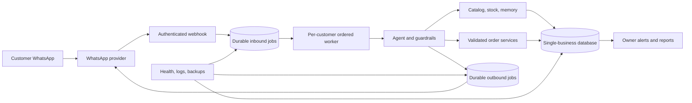

# Real-Business Production Readiness Plan

> **Document type:** Production-hardening specification and decision record  
> **Status:** Proposed work — this document does not claim that the proposed capabilities are built  
> **Version scope:** Separate from Versions 1–3 and not a new numbered promise  
> **Canonical status tracker:** `docs/ENGINEERING_ROADMAP.md` remains the only source of completion status

## 1. Purpose

This document defines what must change before the WhatsApp assistant can safely serve a real retail business and real paying customers. It is intentionally conservative. A feature appears here because it is required or strongly recommended; its appearance does **not** mean it already exists.

The current project is a capable, verified single-business prototype. It can converse with customers, remember context, consult a catalog and live inventory, record orders and payments, maintain a ledger, move orders through a state machine, notify the owner, and answer a fixed set of owner analytics questions. Those foundations should be preserved.

However, connecting a real store introduces consequences that demonstrations do not: incorrect prices can lose money, overselling can disappoint customers, accepting an unverified payment claim can corrupt accounts, lost messages can lose sales, exposed conversations can violate customer privacy, and an unavailable service can damage the client's reputation. Production readiness therefore requires more than deploying the current process to a public URL.

## 2. Scope and permanent boundaries

This plan keeps the project's established single-business design:

- One deployment serves one business.
- Each business receives an isolated database, WhatsApp number, API credentials, configuration, backups, and monitoring.
- There is no shared multi-tenant database or organization scoping.
- There is no DeskcommCRM integration or adoption of its schema, authentication model, or UI.
- There is no billing platform, BYOK system, B2B lead funnel, multi-agent router, staff RBAC, agent-version publishing system, or other permanent exclusion.
- The public portfolio dashboard remains synthetic and read-only. It must never connect to a real client's database.
- Existing anti-ban pacing remains active unless an explicitly reviewed provider-specific replacement is approved. Production hardening must never introduce an unlimited hidden bypass.

If a future commercial strategy requires one SaaS installation to host many unrelated businesses, that is a new architecture and business decision—not an incremental modification to this codebase.

## 3. Status vocabulary

Every future update to this document or the canonical tracker must use these meanings precisely:

- **Built:** code exists, but may not have been tested in a realistic environment.
- **Locally verified:** deterministic tests or direct local inspection passed.
- **Live verified:** behavior was observed through the real WhatsApp path.
- **Mitigated:** impact is reduced, but the root cause remains.
- **Fixed:** the root cause was corrected and the correction was verified.
- **Proposed:** described here but not implemented.
- **Blocked:** cannot proceed safely without a named decision, dependency, or authority.

Never convert “proposed” into “built,” or “mitigated” into “fixed,” merely because a document describes the intended solution.

## 4. Verified baseline at the time of this assessment

The following observations were verified directly on 2026-09-26:

- SQLite integrity check returned `ok`.
- The database contained 39 customer records, 578 messages, 2 orders, and 4 ledger entries.
- No orphan order or ledger rows were found.
- No product currently had negative stock.
- The live `products` table contained only one leftover temporary product: `Test Hoodies (temporary — delete after 2.2 live verification)`, medium, black, price 800, stock 19.
- `catalog.md` advertised shirts, kurtas, trousers, and sizes S/M/L/XL. The written catalog and live inventory therefore did not represent the same store.
- The application process responded locally, but the customer-facing runtime did not expose a dedicated application health endpoint.
- The public Render deployment was the synthetic portfolio demo, not the real customer-facing WhatsApp service.
- The worktree already contained unrelated local changes. They must remain separate from any production-hardening commit.

These are point-in-time facts. They must be re-verified before implementation or deployment rather than assumed from this document.

## 5. Current strengths to preserve

Production work should extend, not bypass, these existing foundations:

1. **One controlled outbound path.** Customer-visible text is sent through a guarded `send_message` tool rather than trusting unobserved model text.
2. **Grounded catalog and stock tools.** General policies are read from `catalog.md`; stock is read from SQLite.
3. **Server-side order state machine.** Orders move forward through placed, confirmed, paid, shipped, delivered, or cancel before shipping.
4. **Ledger-derived balances.** Balances are reconstructed from debit and credit entries rather than a mutable balance field.
5. **Conversation memory.** Recent messages, checkpoints, and customer notes support continuity across conversations.
6. **Owner isolation.** Owner analytics are selected only after a fail-closed phone-number check.
7. **Shared-number pacing.** Customer replies, owner replies, and owner alerts use the same pacing decision for the one WhatsApp number.
8. **Durable owner alerts.** Failed owner alerts remain pending and the existing retry worker retries them.
9. **Idempotency controls.** Provider message IDs are used for bookkeeping receipts and outbound retry protection when available.
10. **Synthetic portfolio data.** The public demonstration is intentionally separated from real customer data.

## 6. Critical release blockers

The following are release blockers for a real paying client. A pilot must not begin until each one is either completed or explicitly removed from the pilot's capabilities.

### 6.1 Real inventory must replace test data

**Current risk:** The catalog says the store sells clothing categories that are absent from the database, while the database contains a temporary hoodie product. The assistant can therefore describe products that cannot be ordered or fail to find products the business actually sells.

**Required outcome:**

- Obtain an owner-approved inventory file.
- Import SKU, product name, category, size, color, authoritative price, stock, active state, and optional aliases.
- Reject malformed rows and report them without partially importing an inconsistent file.
- Support safe re-import/upsert by stable SKU or variant key.
- Mark discontinued products inactive instead of deleting history used by prior orders.
- Reconcile `catalog.md` categories and policies with the imported inventory.
- Remove the temporary test product only after an export/backup and explicit target verification.

**Code locations:**

- `db/schema.sql`: expand the product representation and add uniqueness constraints.
- `scripts/seed-catalog.ts`: replace sample-only seeding with a validated onboarding/import path.
- `src/tools.ts`: normalize size/color aliases and exclude inactive variants.
- `catalog.md`: client-approved general catalog and policies, never manually maintained exact stock.

**Acceptance criteria:**

- Every advertised product category has at least one valid active database variant, or the catalog explicitly says it is unavailable.
- “M,” “medium,” and configured aliases resolve consistently.
- Zero-stock and inactive variants are never described as available.
- Importing the same file twice does not duplicate variants.
- A reconciliation report lists database-only and catalog-only products.

### 6.2 Price must be authoritative on the server

**Current status (2026-09-29): base product-price authority and exact monetary storage are fixed and locally verified.** `record_order` accepts only product ID and quantity in its model-facing schema. The shared server validator loads `products.price_minor`, creates integer-paisa price snapshots, and computes the order total for both the normal tool path and the turn-close safety net. Human/model-facing APIs still use rupees at explicit boundaries. A guarded, atomic migration converted `products.price`, `orders.total`, `ledger.amount`, `payment_claims.amount`, and every order-item price snapshot from rupees to integer Pakistani paisas. Before migration, a byte-identical database backup was verified. After migration, the real database retained 1 product, 3 orders, 6 ledger entries, and the approved payment claim; all converted values reconciled, `integrity_check` returned `ok`, and `foreign_key_check` returned no violations. Integer-type database constraints reject fractional paisas. The permanent suite passed 68/68, focused order tests 8/8, focused ledger tests 5/5, typecheck/build, pacing/alerts, and the complete Version 2 flow passed. The existing real WhatsApp order previously verified normal server-authoritative pricing; the exact-money migration itself is **locally verified**, not yet re-verified through a new live WhatsApp message.

**Remaining risk:** order item snapshots remain JSON rather than relational rows. Shipping, explicit approved discounts, tax, quote expiry/price locking, and relational `order_items` are not part of this completed slice and remain proposed below.

**Required outcome:**

- **Completed locally:** the model-facing order tool supplies only product/variant ID and quantity.
- **Completed locally:** the server reads the current product price and calculates the current item subtotal/total.
- **Still proposed:** the server computes shipping, approved discounts, tax if applicable, and final quote total.
- Any discount is represented explicitly and validated against the business rule.
- **Completed locally:** store money as integer Pakistani paisas; binary floating-point `REAL` is no longer financial truth.
- **Completed locally:** preserve an integer-paisa price snapshot on each order item so historical orders do not change when the catalog price changes.

**Code locations:**

- `src/tools.ts`: server-authoritative base product pricing completed; extend it later for the approved quote components above.
- `db/schema.sql`: integer monetary fields are complete; relational `order_items` remains proposed.
- `src/ledger.ts`: exact integer-paisa storage is complete, with rupee conversion only at its public boundary.
- `src/analytics.ts` and `src/followups.ts`: read integer-paisa storage and preserve their existing rupee-facing business meaning.

**Acceptance criteria:**

- **Passed locally:** a forged tool call with a lower price is ignored in favor of the database price.
- **Passed locally:** totals are deterministic and exact, including decimal-rupee multiplication without floating-point drift.
- **Passed locally:** historical order prices remain unchanged after product price updates.
- **Passed locally:** all order, ledger, analytics, follow-up, payment-claim, and cancellation regressions pass after migration.

### 6.3 Stock reservation must be atomic and cannot become negative

**Current status (2026-09-29): fixed in code, locally verified, and the normal
customer-facing insufficient-stock refusal is live-verified.** Order confirmation now runs
inside an SQLite `IMMEDIATE` transaction, aggregates duplicate product lines,
and reserves each product with a conditional `stock >= required quantity`
update before changing status. If any line is unavailable or missing, the
entire transition rolls back. Cancellation restoration, its ledger reversal,
and the status change now share that same transaction. Insert/update triggers
reject any direct negative-stock write as a database backstop.

**Remaining risk:** this slice preserves the existing decision that the order
debit is written at `placed`, before stock is reserved at `confirmed`. Changing
when money becomes owed requires the explicit owner decision listed in section
20 and is not silently bundled into stock safety. Transition actor/source and
status audit history were completed separately on 2026-09-29 as described in
section 6.4.
The concurrency/rollback invariant is proven deterministically, not by trying
to manufacture a timing race through two real WhatsApp customers.

**Required outcome:**

- **Completed locally:** validate stock again at confirmation time.
- **Completed locally:** wrap status transition, stock reservation/restoration,
  and cancellation ledger reversal in one transaction.
- **Completed locally:** use a conditional update that succeeds only when
  enough stock remains.
- **Completed locally:** return a clear recoverable result when another
  customer bought the final item first.
- **Completed locally:** preserve exactly-once reservation and restoration.
- **Completed separately:** transition actor/source and persistent status
  audit history (section 6.4).

**Code locations:**

- `src/orders.ts`: transactional, conditional stock reservation is completed.
- `src/tools.ts`: return actionable errors to the model without guessing alternatives.
- `db/schema.sql`: negative-stock triggers are completed for existing and new
  databases; order-status history is now also implemented separately.

**Acceptance criteria:**

- **Passed locally:** quantity greater than stock cannot be confirmed.
- **Passed locally:** two competing confirmations for the last unit result in
  exactly one success.
- **Passed locally:** a failed multi-item confirmation rolls back earlier line
  reservations and changes neither status nor ledger.
- **Passed locally:** cancelling a reserved order restores stock and reverses
  its debit exactly once in the same transaction.
- **Passed locally:** a forced ledger-reversal failure rolls back cancellation
  status and stock restoration, leaving no partial credit.
- **Passed locally:** direct negative-stock writes are rejected by SQLite.
- **Passed live:** with database stock at 18, a real customer requested 20
  medium black hoodies. The assistant stated only 18 were available; no order
  or ledger row was added, stock remained 18, and the inbound event completed
  once with `attempt_count = 1`.

### 6.4 Customers must not verify their own payment or fulfilment state

**Current status (2026-09-29): built, locally verified, and live-verified
through real WhatsApp customer and owner turns.** The customer-facing tool list no longer exposes
`record_payment`, and customer `update_order_status` is limited to confirming
or cancelling the customer's own order. A statement such as “I paid” now
creates a durable, idempotent `payment_claims` row with status `pending` and a
durable owner alert; it cannot create a ledger credit or mark an order paid,
shipped, or delivered. The turn-close safety net follows the same claim path
instead of silently crediting the ledger.

The narrowly scoped owner-only path can list pending claims and approve or
reject a specific claim after Ahmed checks it. Approval and its ledger credit
commit in one immediate transaction, repeated approval cannot duplicate the
credit, rejection creates no credit, and neither decision changes order status.
A forced ledger-write failure rolls the transaction back and leaves the claim
pending. The older internal `recordPayment` primitive remains exported only for
legacy deterministic regression coverage; it is not reachable from the
customer or owner tool menus.

**Live proof:** customer 9958 reported Rs.800 paid by Easypaisa for confirmed
order #41 with reference `TEST-800`. The turn created pending claim #1 and
delivered owner alert #15 exactly once, while the ledger stayed at five rows
with zero customer credit and order #41 stayed `confirmed`. Owner 2409 then
listed the real pending claim and explicitly approved it. Claim #1 became
`approved`, exactly one Rs.800 credit was added (ledger row #77; total rows
5→6), and order #41 remained `confirmed`. Database integrity returned `ok`
with zero foreign-key violations.

**Still required before production:** actual trusted shipped/delivered command
or integration paths, external payment-provider verification, and exact-money
migration remain proposed work; this change does not claim those are complete.

**Actor/source audit hardening (2026-09-29): built and locally verified.** A
new append-only application history records initial `placed` state and every
successful transition with from/to status, actor type, actor customer when
applicable, source, source-event key, evidence, and timestamp. The core state
machine fails closed without valid context and independently enforces customer,
owner, payment-provider, courier, and system actor boundaries. Each event is in
the same transaction as order, ledger, and stock effects, so an audit-write
failure rolls everything back. Existing orders remain without fabricated
history because their original actor/evidence cannot be reconstructed. This
slice intentionally exposes no new owner/courier/provider mutation tool.

**Required outcome:**

- Customer statements create a `payment_claim` or handoff, not a confirmed ledger credit.
- Only a trusted owner action or verified payment-provider event records payment.
- Only trusted owner/courier operations mark an order shipped.
- Delivery confirmation rules are explicitly chosen by the business.
- **Completed locally:** every new creation and sensitive transition records
  actor, source, timestamp, and evidence/reference.
- Owner analytics remain read-only; a separate minimal trusted operational command path may be designed only after explicit approval. It must not become a general CRM.

**Implemented code locations:**

- `src/agent.ts`: customer and safety-net payment statements create claims;
  owner turns receive only the narrow claim-review tools.
- `src/payments.ts`: idempotent claim creation, pending-claim query, and atomic
  owner approve/reject resolution.
- `src/tools.ts`: customer claim/status permissions and owner-only claim tools.
- `db/schema.sql`: durable payment claims and payment references.

**Remaining code locations:**

- `db/schema.sql`: complete the exact-money migration.
- A future explicitly approved integration must authenticate real provider or
  courier events before calling the already-restricted domain function.

**Acceptance criteria:**

- ✅ Locally verified: “I paid” creates one pending claim and no credit or
  order-status change.
- ✅ Locally verified: owner approval creates exactly one credit; a retry does
  not duplicate it, and a failed credit leaves the claim pending.
- ✅ Locally verified: customers cannot mark orders paid, shipped, or
  delivered, and claim resolution is absent from their tool menu.
- ✅ Live-verified: one real customer claim alerted owner 2409 exactly once;
  explicit owner approval created exactly one credit while leaving the order
  status unchanged.

### 6.5 Orders need complete fulfilment information

**Current risk:** Orders do not contain enough information to deliver a parcel. Customer names are not reliably promoted from conversation into structured customer records, and there are no recipient, address, city, postal code, courier, or tracking fields.

**Required outcome:**

- Collect recipient name, contact phone, address, city, postal code when relevant, landmark/instructions, payment method, and customer confirmation.
- Store shipping charge, courier, tracking number, and fulfilment notes.
- Show the customer a final summary and require explicit confirmation before placement.
- Validate required fields server-side; do not rely on the model merely remembering to ask.
- Decide whether delivery is nationwide, which regions are unsupported, and whether charges vary by region.

**Code locations:**

- `db/schema.sql`: structured fulfilment and order fields.
- `src/tools.ts`: server validation and final order creation contract.
- `src/agent.ts`: conversation instructions and safe confirmation flow.
- `catalog.md`: owner-approved delivery, payment, return, and exchange policies.

**Acceptance criteria:**

- An order cannot be confirmed for shipping without required fulfilment fields.
- The stored order matches the customer-confirmed summary.
- Sensitive address data is not written to ordinary logs.

### 6.6 Opt-out and privacy controls are mandatory

**Current risk:** Raw phone numbers and full conversation bodies are stored indefinitely, and STOP/opt-out handling is not built.

**Required outcome:**

- Recognize STOP, unsubscribe, and approved Roman Urdu equivalents deterministically before calling the model.
- Store `opted_out_at` and prevent further automated sends except a legally/operationally appropriate confirmation.
- Define retention periods for raw messages, checkpoints, notes, orders, and financial records.
- Provide documented customer-data export and deletion procedures subject to required financial-record retention.
- Redact phone numbers, message content, addresses, tokens, and payment references from logs.
- Encrypt storage/backups where supported and restrict access to the business deployment.
- Publish an accurate privacy notice and preserve the one-time AI disclosure.

**Code locations:**

- `src/server.ts`: deterministic inbound opt-out interception.
- `src/agent.ts`: outbound eligibility check before every customer send.
- `db/schema.sql`: consent/opt-out fields and retention metadata.
- `src/obs/logger.ts`: structured redaction.
- Operations documentation: retention, export, deletion, and incident procedures.

**Acceptance criteria:**

- An opted-out customer receives no marketing/follow-up automation.
- Opt-out remains effective after restart.
- Logs and backups do not expose secrets.
- Deletion/export procedures are tested on non-production data.

## 7. Business-specific onboarding configuration

Hardcoded references to Ahmed and the clothing shop must be replaced by one validated business configuration loaded at startup.

### 7.1 Proposed required configuration

```text
BUSINESS_NAME
ASSISTANT_NAME
OWNER_PHONE
BUSINESS_TIMEZONE
BUSINESS_CURRENCY
WHATSAPP_NUMBER_ACTIVATED_ON
DISCOUNT_APPROVAL_PERCENT
BUSINESS_HOURS_START
BUSINESS_HOURS_END
CATALOG_PATH
DATABASE_PATH
LOG_LEVEL
```

Provider-specific secrets belong in the host's secret manager, not a committed file:

```text
LLM_API_KEY
WHATSAPP_ACCESS_TOKEN or WAHA_API_KEY
WHATSAPP_WEBHOOK_VERIFY_TOKEN
WHATSAPP_APP_SECRET
```

Missing or invalid critical configuration must fail closed at startup. For example, an invalid owner phone must disable owner mode, an invalid activation date must select conservative pacing, and an invalid database path must stop startup rather than silently create a new empty production database in the wrong directory.

### 7.2 Files requiring generalization

- `.env.example`: document safe placeholders only.
- `src/agent.ts`: business name, owner name, assistant disclosure, tone, language, discount policy.
- `src/tools.ts`: descriptions and handoff language.
- `src/alerts.ts`: alert heading and owner-facing wording.
- `src/owner.ts`: generic owner configuration naming while preserving fail-closed matching.
- `src/analytics.ts`: generic labels and explicitly defined metrics.
- `src/guardrails/pacing/defaults.ts`: business timezone and activation date remain environment-driven.
- `catalog.md`: store-specific general information.
- `README.md`: separate development/demo instructions from production operations.

### 7.3 Onboarding inputs required from each business

Before configuration begins, obtain written owner approval for:

- Legal/display business name and owner contact.
- Dedicated WhatsApp Business number.
- Number activation date and timezone.
- Product/variant inventory and authoritative prices.
- Currency, tax, discounts, shipping charges, and COD rules.
- Payment methods and how each payment is verified.
- Delivery regions, timelines, courier workflow, return and exchange rules.
- Business hours and after-hours behavior.
- Languages, tone, prohibited claims, and escalation rules.
- Privacy notice, retention duration, and opt-out wording.
- Which actions the assistant may perform automatically and which always require owner confirmation.

Verbal assumptions should not be translated into production rules.

## 8. WhatsApp provider strategy

### 8.1 Recommended commercial path

For a paid deployment, add an adapter for the official Meta WhatsApp Business Platform Cloud API. Preserve the current `ChannelAdapter` seam so the rest of the agent remains provider-independent.

The client onboarding requirements generally include a Meta business portfolio, WhatsApp Business Account, business number, access credentials, webhook configuration, and approved display/business setup. Current Meta requirements must be rechecked from official documentation at implementation time.

### 8.2 Role of WAHA

WAHA remains useful for local development and controlled demonstrations. If it is used temporarily in a pilot:

- The client must understand that it is a web-session gateway rather than the preferred production provider.
- Session state must live on a persistent volume.
- API authentication must be enabled.
- The service must bind only to trusted interfaces or a private network.
- QR re-linking and session recovery must have an owner-approved runbook.
- Account/session health must be monitored.

### 8.3 Required provider work

- Add `src/channel/meta-cloud.ts` implementing `ChannelAdapter`.
- Add configuration-based adapter selection.
- Verify webhook subscription tokens.
- Verify request authenticity/signatures before parsing inbound content.
- Store provider message IDs and delivery status events.
- Add network timeouts, bounded retry with backoff, and error classification.
- Handle text first; explicitly reject or hand off unsupported voice, image, document, reaction, group, and location messages until implemented.
- Preserve fail-closed LID/JID handling in the WAHA adapter.

## 9. Reliable message-processing architecture

The current webhook processes a complete model turn inline. A production webhook should acknowledge valid provider events quickly and move work into durable processing.



### 9.1 Required guarantees

- Deduplicate inbound provider message IDs before creating side effects.
- Process messages from the same customer in order.
- Allow controlled concurrency across different customers.
- Persist jobs before acknowledging events that must not be lost.
- Persist outbound intent before provider transmission.
- Reconcile the ambiguous case where the provider accepts a message but the process crashes before local `sent` recording.
- Retry only retryable failures, with bounded exponential backoff and dead-letter visibility.
- Defer outside-hours replies until the allowed window rather than discarding them.
- Keep the existing owner-alert retry worker; integrate with it or migrate deliberately, never create a parallel duplicate worker.
- Preserve one-number aggregate pacing across customer replies, owner replies, and alerts.
- Run a single application worker until cross-process locking or a shared queue is proven.

### 9.2 Code locations

- `src/server.ts`: webhook verification, fast acknowledgement, health routes, graceful shutdown.
- New narrow queue/outbox modules: durable inbound and outbound job state.
- `src/agent.ts`: execute a claimed inbound job and create outbound intent.
- `src/alerts.ts`: keep durable alert semantics and existing-alert idempotency.
- `src/channel/*`: provider status/retry classification.
- `db/schema.sql`: inbox, outbox, attempts, provider IDs, and status indexes.

## 10. Database and migration hardening

SQLite remains acceptable for one business and one active application process if it is operated carefully.

Required improvements:

- Make the database path explicit and validated.
- Explicitly enable and verify foreign keys at startup even if the current runtime reports them enabled.
- Review WAL mode, busy timeout, synchronous settings, and backup compatibility.
- Replace ad hoc startup schema rewrites with numbered, transactional migrations.
- Back up before every migration.
- Never run a destructive migration without a tested rollback/restore path.
- Add indexes for high-frequency queries: customer messages, order status/date, ledger by customer/order, pending alerts, inbox/outbox states.
- Add constraints for stock, monetary values, product uniqueness, and recognized state values.
- **Completed locally 2026-09-29:** append-only application order-status
  history and actor/source/evidence attribution. Existing history was not
  fabricated; database-admin retention/tamper policy remains operational work.
- Test database recovery from the actual backup artifact, not only backup creation.

Suggested data additions, subject to detailed design:

- `products`: SKU, category, active, price minor units, timestamps.
- `orders`: fulfilment snapshot, payment method, shipping amount, currency, timestamps.
- `order_items`: product ID, SKU/name snapshot, quantity, unit price, discount, line total.
- `order_status_events`: **implemented** with from/to, actor type, actor
  customer, source, source-event key, evidence, and timestamp.
- `payment_claims` and/or `payments`: reference, amount, method, verification status, provider event ID.
- `customers`: structured name, opt-out/consent fields.
- `inbound_jobs` and `outbound_jobs`: durable processing and retry state.

## 11. AI and tool safety

The language model may propose actions; it must never be the authority for financial facts, stock, identity, or authorization.

Required rules:

- All prices, stock, totals, status transitions, discounts, and payment effects are recalculated or validated server-side.
- Tool schemas are guidance; server validation is the security boundary.
- Owner identity is decided before model invocation, not inferred from message text.
- Customer and owner tool lists remain separate.
- Unknown catalog questions cause an honest handoff, not a guess.
- The model cannot issue arbitrary SQL.
- Prompt text and customer messages cannot select hidden tools or bypass guardrails.
- Model calls have timeouts, limited retries, maximum tool steps, and cost/usage visibility.
- A provider/model outage produces a durable retry or owner-visible failure, not silent loss.
- Human handoff promises require an actual persisted handoff.

The existing deterministic guardrails should remain. New tests must attempt adversarial tool inputs directly instead of relying only on conversational prompts.

## 12. Analytics definitions requiring owner approval

Business labels must match what the query actually measures. The current “sales today” function sums non-cancelled orders created today, including orders that may not be paid or delivered. Before a real launch, separate:

- Orders placed today.
- Gross confirmed order value.
- Payments received today.
- Delivered revenue.
- Outstanding receivables.
- Store credit/refunds.
- Cancelled value.
- Units sold by confirmed, paid, or delivered definition.

The owner must select the official definitions. `src/analytics.ts` should then encode those definitions deterministically, with tests covering midnight in the business timezone, cancellation, partial payment, refund, and store credit.

## 13. Deployment and operations

The portfolio demo deployment must remain separate from the customer runtime.

### 13.1 Production environment requirements

- Always-on compute appropriate for webhooks and workers.
- Persistent encrypted storage for the real database.
- HTTPS endpoint and authenticated webhook.
- Managed secret storage; no production secret in Git, images, logs, or portfolio artifacts.
- Persistent provider session volume if WAHA is used.
- Automated process restart and dependency startup ordering.
- `/health` for process liveness and `/ready` for database/provider readiness.
- Graceful shutdown that stops accepting jobs, finishes or releases claimed work, and closes the database.
- Scheduled backups with retention and off-host copies.
- Monitoring for queue backlog, provider disconnect, model failures, database errors, pending alerts, pacing vetoes, and repeated fallback replies.
- Owner notification path that does not depend solely on the failed component.

### 13.2 Timeout and retry requirements

- LLM requests need an abort timeout and classified retries.
- Provider send requests need an abort timeout and classified retries.
- Permanent 4xx/configuration failures must not retry forever.
- Rate-limit and transient failures use backoff and preserve idempotency.
- All retry loops have maximum attempts or dead-letter escalation.

### 13.3 Backup and recovery acceptance

- Restore a backup into a clean environment.
- Verify row counts, integrity, foreign keys, orders, ledger balances, and pending jobs.
- Document recovery point objective and recovery time objective agreed with the client.
- Record the last successful backup and restore drill.

## 14. Testing strategy

Use deterministic tests for server rules and live WhatsApp tests for customer-visible behavior.

### 14.1 Mandatory deterministic tests

- Business configuration parsing and fail-closed startup.
- Product import validation, idempotent re-import, aliases, inactive products.
- Database-authoritative price and exact monetary arithmetic.
- Quantity validation and zero/negative stock protection.
- Two concurrent confirmations competing for final stock.
- Transaction rollback when any order side effect fails.
- Customer payment claim cannot create a credit.
- Trusted payment event is idempotent.
- Every permitted and forbidden status transition by actor type.
- Required fulfilment fields and explicit customer confirmation.
- Opt-out parsing, persistence, and outbound suppression.
- Webhook verification/signature rejection.
- Inbound deduplication and ordered same-customer processing.
- Outbound crash/retry ambiguity and duplicate prevention.
- Outside-hours durable defer and next-window processing.
- Owner/customer tool isolation.
- Data retention and log redaction.
- Backup restore and migration rollback.
- Analytics definitions across timezone boundaries.

### 14.2 Mandatory live verification

Use dedicated test customer and owner numbers, never unsuspecting real customers. Verify:

1. First-contact AI disclosure appears exactly once.
2. Real inventory question returns the correct size, color, price, and stock.
3. Out-of-stock request is refused honestly.
4. Final order summary matches the database and customer confirmation.
5. Discount above the approval threshold is handed off without being granted.
6. Payment claim alerts the owner but does not mark paid.
7. Owner verification marks payment exactly once.
8. Unknown policy question creates one owner alert and an honest customer reply.
9. Memory recall works on a later day.
10. Outside-hours message is retained and answered when permitted.
11. STOP prevents later automated messages.
12. Provider restart and application restart do not lose or duplicate the test order/reply.

Every live test must record timestamp, source number suffix, expected result, actual result, database evidence, and whether the result is live verified. Real credentials and full customer numbers must not be committed.

## 15. Launch stages and gates

### Stage A — Specification freeze

- Owner approves product data, policies, payment verification, fulfilment fields, analytics definitions, business hours, escalation, and privacy rules.
- Provider choice and hosting choice are approved.
- No unresolved assumption is embedded in code.

### Stage B — Financial and inventory integrity

- Server-authoritative pricing completed.
- Atomic stock reservation completed.
- Trusted payment/status authority completed.
- Monetary migration completed and restored from backup in a rehearsal.

### Stage C — Real-store configuration

- Generic business configuration completed.
- Real inventory imported and reconciled.
- Fulfilment information and explicit order confirmation completed.
- Owner-approved catalog installed.

### Stage D — Reliability, privacy, and provider

- Authenticated production webhook completed.
- Durable inbound/outbound processing completed.
- Opt-out and retention controls completed.
- Health, monitoring, timeout, retry, backup, and recovery completed.

### Stage E — Controlled pilot

- One isolated client deployment.
- Small invited test group and low order volume.
- Daily review of conversations, incorrect answers, handoffs, order reconciliation, provider health, and backups.
- Manual owner confirmation for sensitive actions.
- Written rollback and pause procedure.

### Stage F — Commercial launch

Launch only when all release gates below pass and the owner signs off on observed live behavior.

## 16. Go-live checklist

No real customer launch is approved unless every applicable item is checked with evidence:

- [ ] Real product database contains no temporary test records.
- [ ] Catalog and inventory reconciliation passes.
- [ ] Server controls price and exact totals.
- [ ] Stock cannot become negative under concurrency.
- [ ] Customer claims cannot verify payments or shipping.
- [ ] Fulfilment details are complete and customer-confirmed.
- [ ] Owner number and owner-only routing are verified live.
- [ ] Number activation date, timezone, pacing stage, and cap are verified.
- [ ] STOP/opt-out works live and persists after restart.
- [ ] Webhook authenticity is enforced.
- [ ] Secrets are absent from Git, images, logs, and public demo assets.
- [ ] Real database is on persistent storage and excluded from public deployment.
- [ ] Backups run and a restore drill passes.
- [ ] Health/readiness and alerting work.
- [ ] Provider and LLM timeouts/retries are bounded.
- [ ] Same-customer message ordering and inbound deduplication pass.
- [ ] Outside-hours messages are durably deferred, not lost.
- [ ] Order, payment, alert, and outbound delivery are idempotent under retry.
- [ ] Required deterministic test suite passes from a clean environment.
- [ ] Required real WhatsApp scenarios pass with exact database reconciliation.
- [ ] Owner approves policies, wording, permissions, and analytics definitions.
- [ ] Incident pause, rollback, recovery, and customer-support procedures exist.

## 17. Incident safety and rollback

The business needs a fast, understandable way to stop automation without losing customer messages.

Required controls:

- Pause outbound automation while continuing to record inbound events safely.
- Disable sensitive mutations independently from ordinary FAQ replies.
- Route failed or uncertain conversations to the owner.
- Restore the last known-good application version without overwriting the database.
- Restore a verified database backup to a separate file first; never overwrite the only copy during diagnosis.
- Record incidents with timeline, affected customers/orders, containment, correction, verification, and whether the issue is fixed or only mitigated.
- Notify affected customers only after facts and wording are owner-approved.

Triggers for immediate pause include incorrect prices, duplicate charges/orders, negative stock, cross-customer data exposure, webhook spoofing, lost outbound records, repeated unsolicited sends, or an unexplained provider ban/restriction signal.

## 18. Exact implementation map

| Area | Primary files | Required change |
|---|---|---|
| Business identity | `.env.example`, `src/agent.ts`, `src/tools.ts`, `src/alerts.ts`, `src/owner.ts` | Replace functional Ahmed-specific hardcoding with validated single-business configuration. |
| Catalog | `catalog.md`, `src/catalog.ts` | Install owner-approved policies; improve aliases/search only where evidence requires it. |
| Inventory import | `scripts/seed-catalog.ts`, new importer | Replace sample seeding with validated, repeatable real inventory onboarding. |
| Product/order schema | `db/schema.sql`, reviewed migrations | Exact money, order-status audit history, and payment claims are complete; add SKU, active variants, relational order items, fulfilment, and any later approved jobs. |
| Price/order validation | `src/tools.ts` | Derive price and totals from the database and validate required fulfilment data. |
| Atomic state changes | `src/orders.ts`, `src/ledger.ts` | Transactional stock, status, payment, cancellation, and history. |
| Customer/owner authority | `src/agent.ts`, `src/tools.ts`, `src/owner.ts` | Keep customer claims separate from trusted owner/provider actions. |
| Provider | `src/channel/types.ts`, `src/channel/waha.ts`, new `src/channel/meta-cloud.ts` | Official provider adapter, authentication, delivery status, timeout/retry. |
| Webhook/runtime | `src/server.ts` | Verification, durable enqueue, health/readiness, graceful shutdown, limits. |
| Reliability | new narrow inbox/outbox modules, `db/schema.sql` | Durable ordering, deduplication, retry, dead-letter visibility, outside-hours defer. |
| AI provider | `src/llm.ts` | Timeout, classified retry, usage/cost visibility, safe failure. |
| Privacy | `src/server.ts`, `src/agent.ts`, `src/obs/logger.ts`, schema | Opt-out, retention, redaction, export/deletion operations. |
| Analytics | `src/analytics.ts`, `src/followups.ts` | Owner-approved definitions for orders, cash, revenue, receivables, refunds. |
| Deployment | `Dockerfile`, separate production manifest/runbook | Persistent storage, secrets, backups, monitoring; keep demo deployment separate. |
| Verification | `tests/`, `scripts/` | Deterministic safety tests plus controlled live WhatsApp verification records. |

## 19. Recommended first implementation package

The first approved production-hardening package should contain only the highest-risk correctness work:

1. ~~Define exact monetary representation and migration strategy.~~ **Completed and locally verified 2026-09-29: integer Pakistani paisas are now database truth; the guarded migration preserved and reconciled all existing financial rows, with a verified pre-migration backup.**
2. ~~Make base product price authoritative in server code.~~ **Completed and locally verified 2026-09-27; live WhatsApp verification remains separate.**
3. ~~Make stock confirmation atomic and impossible below zero.~~ **Completed
   and locally verified 2026-09-29; the ordinary insufficient-stock refusal is
   also live-verified, while the race/rollback invariant remains deterministic.**
4. ~~Separate customer payment claims from verified payments.~~ **Built and
   locally verified 2026-09-29; also live-verified through a real customer
   claim, exactly-once owner alert, owner lookup, and explicit owner approval.**
5. ~~Add transition actor/source and order-status audit history.~~ **Built and
   locally verified 2026-09-29; no historical rows were fabricated and no new
   trusted mutation channel was exposed.**
6. ~~Add deterministic adversarial and concurrency tests.~~ **Completed locally across authoritative pricing, exact-money boundaries/database constraints, stock races and rollback, payment-claim authority, order-transition authority, and idempotency.**
7. Re-run the existing complete test suite and a controlled live order flow.

Do not combine this package with provider migration, UI work, unrelated architecture edits, or inventory cleanup. Small, auditable commits make rollback and verification safer.

## 20. Decision log required before implementation

The following questions must be answered by the business owner before their dependent code is written:

1. Which WhatsApp provider will production use?
2. What is the authoritative product/SKU source, and who updates stock?
3. When does an order create money owed: placement, owner confirmation, shipment, or another point?
4. How are bank transfer, Easypaisa, JazzCash, COD, refund, and partial payment verified?
5. Who may confirm, cancel, ship, deliver, refund, and edit an order?
6. Which fulfilment fields are mandatory for each delivery method?
7. Are discounts ever automatic below the threshold, or must every discount be owner-approved?
8. What exactly do “sales,” “revenue,” “unpaid,” and “top product” mean for this business?
9. How long are conversations, customer notes, orders, and financial records retained?
10. What should happen outside business hours?
11. Which languages and media types must the first launch support?
12. What outage duration and recovery expectations are acceptable?

Until these answers are documented, implementation must choose the safest fail-closed behavior rather than invent a business rule.

## 21. Completion standard

This production plan is complete only when:

- Every approved requirement has an implementation reference.
- Every critical invariant has a deterministic test.
- Customer-visible behavior has the appropriate live WhatsApp evidence.
- The real database, credentials, and conversations remain private.
- A clean deployment and a backup restore both succeed.
- The business owner verifies the observed end-to-end workflow.
- The canonical tracker replaces its stale status with the verified result.
- “Built,” “locally verified,” “live verified,” “mitigated,” and “fixed” remain accurately distinguished.

Until then, the honest description is: **a strong, functioning single-business prototype being hardened for a controlled real-store pilot—not a generally production-ready SaaS product.**
