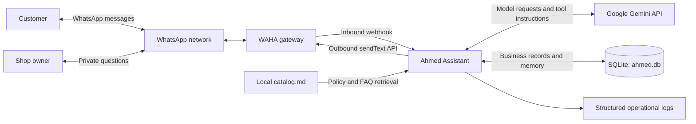
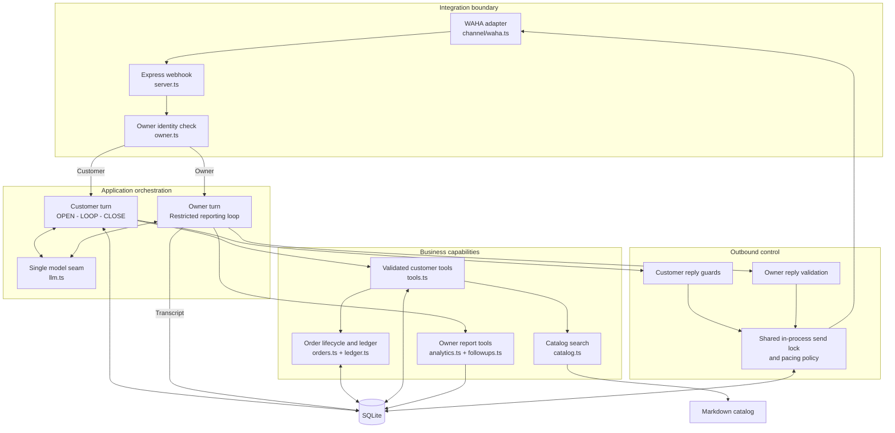
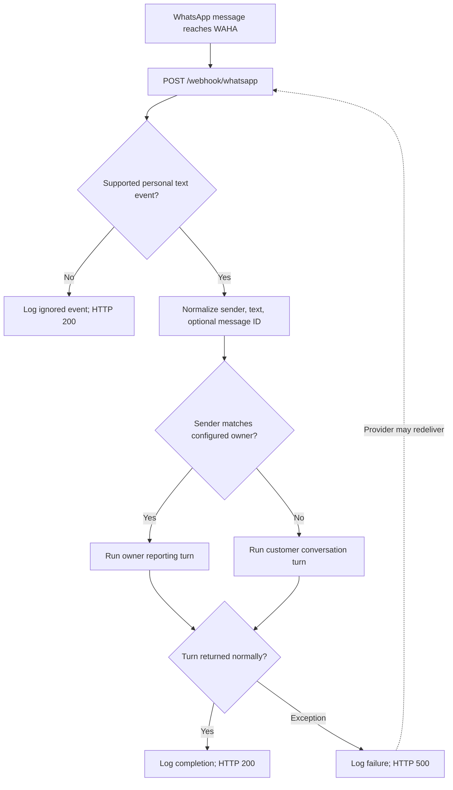
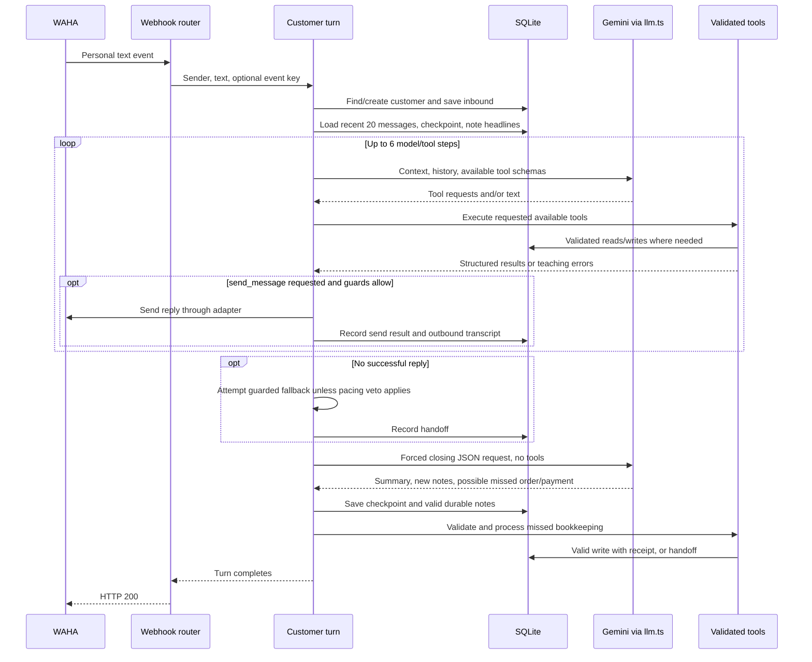
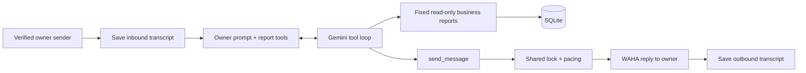
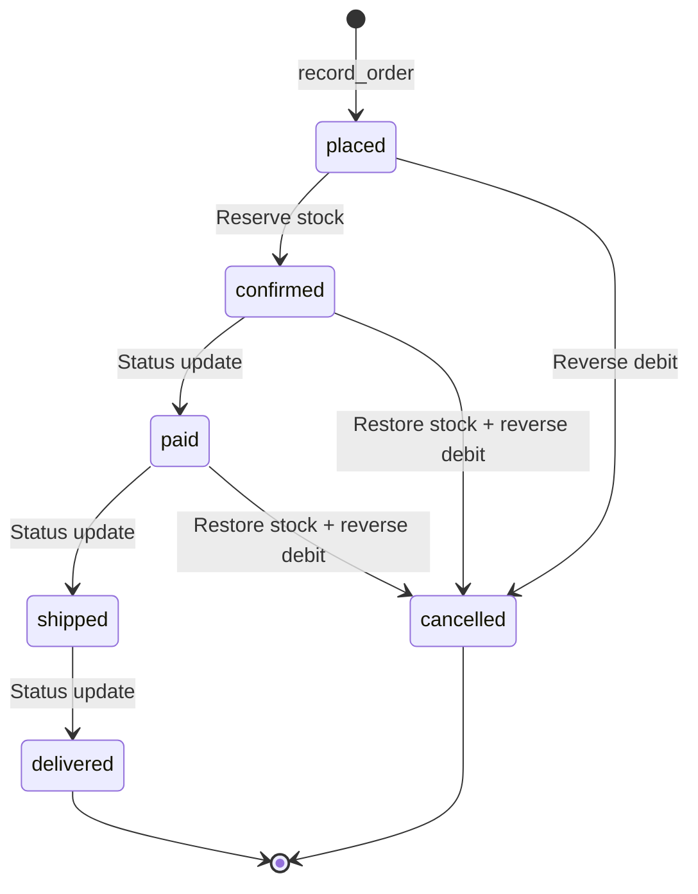
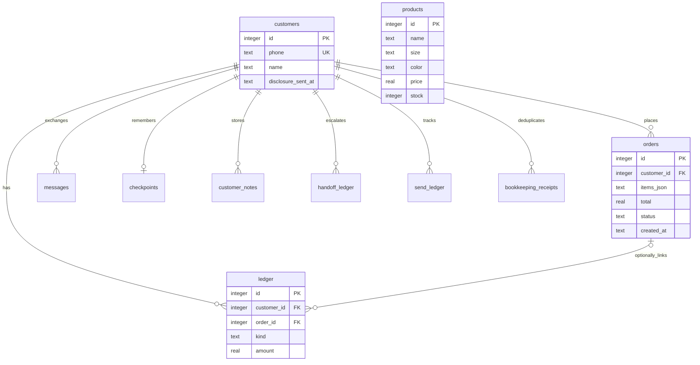
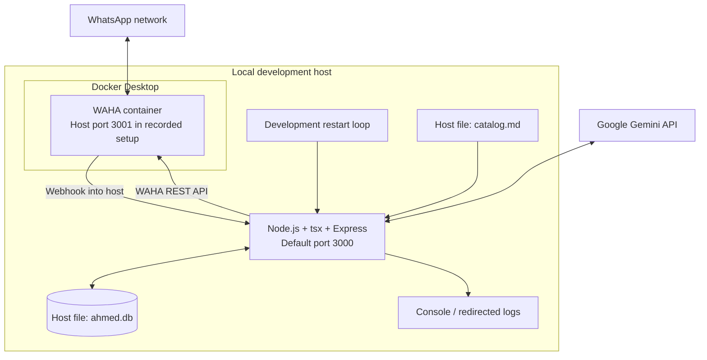

# Ahmed's WhatsApp Assistant

## System Architecture & End-to-End Workflow

**Architecture baseline:** 14 September 2026 · **Audience:** engineering reviewers, project stakeholders, and maintainers · **Style:** single-tenant modular monolith

This document describes the implementation in the repository. Diagrams represent executable components and their responsibilities; planned capabilities are listed separately. Verification milestones belong to `ENGINEERING_ROADMAP.md` and do not imply that every failure boundary is resolved.

## 1. Executive overview

Ahmed's assistant operates one retail shop through WhatsApp. Customers can ask about products, place orders, report payments, and continue conversations with saved context. The owner uses a separate, restricted conversation path to query business reports.

One Node.js/TypeScript application coordinates messaging, model calls, business rules, and SQLite persistence. WAHA supplies the WhatsApp connection. Gemini interprets natural language and requests named tools; application code validates and executes those tools. SQLite holds business records and conversation memory. A local Markdown catalog supplies general product and policy information.

### System context

The customer and owner are separate senders contacting the same business WhatsApp account. The owner's identity is determined by the configured sender number, never by a message claiming to be Ahmed.

## 2. Component architecture

These are logical modules inside one application, not independently deployed microservices. Both turn types use the same model provider and sending account. Requests can overlap while awaiting external calls; the send lock serializes outbound decisions and delivery within one process.

| Layer | Source | Responsibility |
|---|---|---|
| HTTP entry point | `src/server.ts` | Receive JSON webhooks, normalize events, select turn type, acknowledge completion |
| Channel abstraction | `src/channel/types.ts`, `src/channel/waha.ts` | Isolate provider payloads, personal-chat parsing, message IDs, session configuration, and outbound HTTP |
| Identity | `src/owner.ts` | Normalize sender numbers and compare with `AHMED_OWNER_PHONE`; missing configuration disables owner recognition |
| Conversation orchestration | `src/agent.ts` | Build context, run up to six model/tool steps, guard replies, save customer memory |
| Model integration | `src/llm.ts` | Translate internal content blocks to Gemini requests and responses; preserve tool signatures and wrap tool results as objects |
| Tool boundary | `src/tools.ts` | Validate business inputs, scope customer access, dispatch reads/writes, persist bookkeeping receipts |
| Retail domain | `src/orders.ts`, `src/ledger.ts` | Validate lifecycle transitions, adjust stock, post debits/credits, derive balances |
| Reports | `src/analytics.ts`, `src/followups.ts` | Compute fixed reports from current business data |
| Knowledge retrieval | `src/catalog.ts`, `catalog.md` | Read local catalog sections and rank keyword matches; no embeddings or vector database |
| Persistence | `src/db.ts`, `db/schema.sql` | Open the local SQLite file, create schema, apply guarded migrations |
| Operations | `src/obs/logger.ts` | Structured information, warning, handoff, and failure records |

## 3. Complete inbound workflow

The adapter ignores self echoes, groups, unsupported event types, empty text, and non-personal chat surfaces. Privacy LIDs require a resolved phone-number JID. An HTTP 200 acknowledges application handling; it is not proof of a delivered reply, because a tool may have been blocked by pacing or returned an error without throwing.

There is no durable inbound queue. The webhook request awaits the turn. A process crash or request failure can therefore lead to provider redelivery.

## 4. Customer conversation workflow

### OPEN: build grounded context

The application saves the incoming text, loads the most recent 20 transcript entries in chronological order, loads the customer's rolling checkpoint, and includes active durable-note headlines. A tool can retrieve the full body of a customer-owned note. The checkpoint is a model-generated summary; ledger and stock queries remain the authoritative source for business figures.

### LOOP: interpret, validate, execute

The model chooses from a fixed tool list. Business functions validate inputs before acting and return structured results. Errors can guide the model to correct a request on a later step. Plain model text does not itself send a WhatsApp reply. A successful `send_message` call is the delivery path.

| Customer tool | Operation |
|---|---|
| `check_stock` | Read matching product rows, prices, and current stock |
| `search_catalog` | Retrieve a matching FAQ/policy section |
| `get_customer_balance` | Read this customer's derived ledger balance |
| `get_customer_note` | Retrieve a note only when it belongs to this customer |
| `record_order` | Validate items, insert a placed order and debit |
| `record_payment` | Validate a positive amount and post a credit |
| `update_order_status` | Check customer ownership and validate the requested transition |
| `notify_owner` | Persist a handoff and emit `NEEDS AHMED` in logs |
| `send_message` | Attempt a guarded reply through WAHA |

### CLOSE: preserve memory and catch missed bookkeeping

A separate model call requests JSON containing a summary, new durable notes, and possible unlogged orders/payments. The application replaces the checkpoint and inserts valid new notes. For each bookkeeping type, a primary tool call during the turn prevents the closing safety net from duplicating it. Valid confident payloads can be recorded; uncertain or invalid reports with usable details become handoffs. Malformed JSON falls back to storing available closing text as a summary.

## 5. Owner workflow and reporting semantics

The owner path exposes four business reports plus its own send tool. It does not expose customer order/payment mutations. It saves transcripts for pacing and observability but does not load conversation history into the owner prompt or write checkpoints and durable notes.

| Report | Actual calculation |
|---|---|
| `sales_today` | Sum non-cancelled order totals from the shop-local day's start; this is order value, not cash collected |
| `unpaid_customers` | Customers with positive derived balances, highest first |
| `top_selling_product` | Highest ordered quantity across all non-cancelled orders; all time; ties resolved by lowest product ID |
| `pending_followups` | Placed/confirmed orders aged at least two days; overdue at seven days; oldest first |

Follow-up output separately identifies the customer's account position as `amount_owed`, `store_credit`, or `settled`. An order can remain confirmed while the customer has credit, because order status and customer-wide balance are separate facts. No reminder is scheduled or automatically sent by this query.

## 6. Order, stock, and payment workflow

| Business event | Order record | Inventory | Ledger |
|---|---|---|---|
| Place order | Insert `placed`, items JSON, total | Unchanged | Debit for total |
| Confirm | `placed → confirmed` | Subtract item quantities | Unchanged |
| Record payment | No automatic status change | Unchanged | Customer credit; normally no order ID |
| Mark paid/shipped/delivered | Validate next lifecycle state | Unchanged | Unchanged |
| Cancel before confirmation | `placed → cancelled` | Unchanged | Credit reversing order debit |
| Cancel after reservation | `confirmed/paid → cancelled` | Restore item quantities | Credit reversing order debit |

Payment posting and setting an order to paid are separate tool actions. Payment recording does not integrate with a bank or verify settlement externally. Cancellation preserves prior payments as customer credit; it does not issue a refund through a payment provider.

The customer balance is **sum(debits) − sum(credits)**. A positive value is owed to the shop; a negative value is store credit. This is a customer debit/credit ledger, not a complete double-entry general ledger with balanced journal accounts. Line-item prices are validated for type/range and product existence; catalog-price agreement is requested through the prompt, not enforced by a price-equality check. Stock can become negative; an insufficient-stock rejection is not implemented.

## 7. Persistence model

Relationships above represent schema references. Product IDs inside `orders.items_json` are application-validated references, not a normalized order-items table or SQL foreign key.

| Table | Purpose and lifecycle |
|---|---|
| `customers` | Unique sender identity; also includes the owner for transcript/pacing purposes |
| `products` | Current catalog variants, prices, and stock quantities |
| `orders` | Retail lifecycle, item snapshots, total, creation time |
| `ledger` | Debit/credit events and optional related order |
| `messages` | Inbound/outbound text and timestamps used for history and shared pacing |
| `checkpoints` | One rolling summary per customer, replaced at close |
| `customer_notes` | Durable headline/body facts, optional supersession reference |
| `handoff_ledger` | Human-attention records checked by the promise guard |
| `send_ledger` | Pending/sent customer reply attempts |
| `bookkeeping_receipts` | Saved order/payment results for provider-event retries |

`src/db.ts` opens `ahmed.db`, executes the schema, and performs guarded compatibility migrations. There is no separate production migration service. SQL declares foreign-key references; `src/db.ts` does not explicitly enable `PRAGMA foreign_keys`, so this diagram does not assert connection-level enforcement. Money currently uses SQLite `REAL` values.

## 8. Delivery controls and failure behavior

Customer replies pass through body validation, a recent-success send-receipt check, the shared send lock, pacing, copy repetition checks, discount rules, and a recent-handoff requirement for human promises. The first successful customer reply adds an assistant disclosure. Before calling WAHA, the application writes `pending`; after success it writes `sent`, the outbound transcript, and disclosure state.

Owner replies share the lock and pacing but do not use the customer copy/discount/promise guards or customer send ledger.

| Boundary | Implemented behavior | Practical limit |
|---|---|---|
| Bookkeeping retry | Transaction stores business effect and receipt keyed by event plus effect type | Requires an extracted provider message ID; permits one order and one payment result per event; repeat calls of the same effect return the first result |
| Customer reply retry | Hash of turn key and body; recent `sent` receipt suppresses matching reply | Five-minute window; changed generated wording may differ; external send and local success write are not atomic |
| Order transitions | Forward-only checks reject repeated/invalid transitions | Status, stock, and reversal writes are currently separate SQL statements, not one transaction; a mid-transition crash can leave partial effects |
| Concurrency | Shared in-process promise chain serializes sends | No distributed lock and no per-customer turn queue |
| Pacing | Default 07:00–22:00 Asia/Karachi, 1,200 ms throttle plus up to 800 ms jitter; warm-up caps | Unknown activation date uses the conservative first step, currently 20/day; no durable rescheduling for blocked replies |
| Human handoff | Database row and structured warning | No automatic WhatsApp alert to Ahmed yet |
| Model failure | Error propagates to webhook handling; no provider retry inside `llm.ts` | Provider redelivery may rerun the turn |
| Native runtime crash | Development restart loop used in the recorded live session | Node v24/better-sqlite3 issue is **mitigated, not fixed** |

The bookkeeping receipt is not a whole-message completion record. It does not deduplicate inbound transcript entries, notes, handoffs, or every outbound variation. Missing message IDs leave bookkeeping on its direct-call path. Local tests prove keyed function behavior; they do not establish exactly-once processing across every possible live-provider failure.

Pacing reduces sending risk; it is not a guarantee against WhatsApp account restrictions. Caller-number routing relies on trusted gateway input. The current Express route has no webhook authentication/signature middleware, so gateway trust is an operational boundary, not independent sender authentication at the HTTP endpoint.

## 9. Deployment architecture

The application runs on the host; the gateway runs in Docker. This diagram reflects the recorded development setup and source defaults, not a newly inspected running deployment. The repository does not define a complete managed production deployment or durable restart supervisor. Losing the host process, gateway session, database, or external model access affects availability.

| Configuration | Role |
|---|---|
| `PORT` | Application listener, default 3000 |
| `WAHA_BASE_URL` | Gateway URL, default `http://localhost:3001` |
| `WAHA_SESSION` | Linked WhatsApp session, default `default` |
| `WAHA_API_KEY` | Optional gateway API authentication |
| `GEMINI_API_KEY` | Model API credential |
| `AHMED_OWNER_PHONE` | Trusted owner sender comparison |
| `PACING_TIMEZONE` | Shop timezone override; default Asia/Karachi |

The configured model in `llm.ts` is `gemini-flash-lite-latest`. The application reads configuration from process environment. No real keys or complete personal phone numbers are included in this architecture document.

## 10. Object-oriented design in context

`WahaAdapter` implements `ChannelAdapter` and is instantiated for the runtime gateway. Its constructor supports injecting gateway configuration. `OrderStateMachine` and `LedgerAccount` are in-memory domain abstractions with dedicated tests. The persisted order and ledger paths use the exported SQL-backed functions; the presence of these classes does not mean database writes pass through class instances. Class transition history is in memory, not a durable transition-audit table.

The implementation combines functional orchestration, pure policy functions, explicit tools, and selected classes. The principal architecture boundaries are the channel adapter, the single model seam, validated tool dispatch, and the shared database.

## 11. Verification and scope

The engineering roadmap currently records Version 1 and Version 2 complete, Version 3.1 live-verified, and Version 3.2 partially live-verified. The pending-followup owner question passed; the sales, unpaid-customer, and top-product owner questions still require real-message checks. Version 3.3 alerts remain unbuilt and outside the active scope.

The recorded latest checks are typecheck, 39 permanent tests, the V2 database flow, and focused deterministic safety-net/retry tests. This architecture task inspects code and documents behavior; it does not rerun live tests or upgrade verification status.

Planned or carried-forward capabilities include owner WhatsApp alerts, durable queued retries, broader conversation-memory verification, and remaining reliability gaps documented above. None appears as an implemented service in these diagrams. Multi-tenant organization layers, B2B funnel stages, staff routing, and an operator/conversational dual-agent split are outside the project's established design.

## 12. Source map for reviewers

Read `src/server.ts` for entry and routing; `src/channel/waha.ts` for provider normalization; `src/agent.ts` for the complete customer and owner workflows; `src/tools.ts` for available capabilities and bookkeeping receipts; `src/orders.ts` and `src/ledger.ts` for persisted retail behavior; `src/analytics.ts` and `src/followups.ts` for report definitions; `src/llm.ts` for the model boundary; and `db/schema.sql` with `src/db.ts` for storage and migrations.

Use `docs/ENGINEERING_ROADMAP.md` for verification history and active-version boundaries. Existing `docs/ARCHITECTURE_GUIDELINES.md` is an engineering-principles document; where its descriptions exceed the executable behavior (for example double-entry accounting or automatic handoff delivery), this implementation-oriented architecture states the narrower observed behavior.
